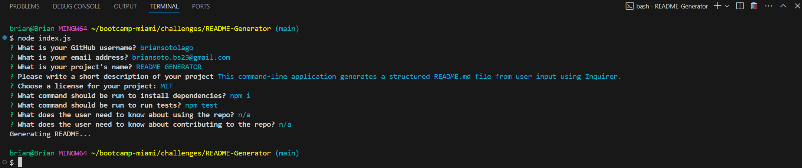
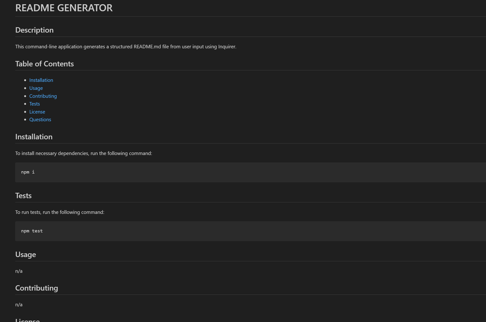

# README Generator

## Description

This project is a command-line application that dynamically generates a **professional README.md file** based on user input. It prompts the user with questions about their project, including the title, description, installation instructions, usage information, and more, then generates a structured README with sections like Installation, Usage, Contributing, License, and Questions.

## Table of Contents
- [Features](#features)
- [Technologies Used](#technologies-used)
- [Installation](#installation)
- [Usage](#usage)
- [Screenshot](#screenshot)
- [Repo](#repo)
- [License](#license)

## Features
- Prompts the user for project details and generates a README.md file.
- Sections included: Title, Description, Installation, Usage, License, Contributing, Tests, and Questions.
- Supports multiple license types with dynamic badge generation.
  
## Technologies Used
- **Node.js**: For the command-line interface.
- **Inquirer.js**: To handle user prompts and input validation.
- **File System (fs)**: To write the generated content to the README.md file.

## Installation

To install the necessary dependencies for this application, run the following command:

```bash
npm install
```

## Usage

To use this application, simply run the following command in your terminal:

```bash
node index.js
```

## Screenshot




 ## Video

[](https://drive.google.com/file/d/1reuWJo3t4hkvgzMTWPRhyB3aiQzIw3z6/view)

## Repo

[GitHub Repo](https://github.com/briansotolago/README-Generator)

## License

[](https://opensource.org/licenses/MIT)
